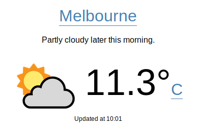

# React Weather
A demo/practice [React](https://reactjs.org/) app created to learn more about managing state with [Redux](https://redux.js.org/). It shows the weather information of the an user-selected location. It fetches weather data from [Dark Sky API](https://darksky.net/dev) via [weather-api-server](https://github.com/hingyeung/weather-api-server).

See the live demo [here](https://weather.demo.samuelli.net).

# Local Development
## start the app
`> npm run start`
## start local api server
`> DARK_SKY_API_KEY=123456789 npm run start-local-api-server`
## run test
`> npm run test`

# Notes
Q: What do I do if I see this error message during development: `Error: watch <some_path_to_file> ENOSPC`?
1. Add the following line to  /etc/sysctl.conf  
`fs.inotify.max_user_watches=524288`  
2. Then apply the change  
`> sudo sysctl -p --system`

Restart IDE if necessary.  
(see https://confluence.jetbrains.com/display/IDEADEV/Inotify+Watches+Limit)

