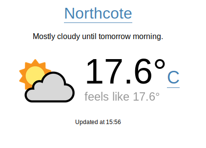

## react-weather-complete
A demo/practice [React](https://reactjs.org/) app created to learn more about managing state with [Redux](https://redux.js.org/). It shows the weather information of a user-selected location. It fetches weather data from [Dark Sky API](https://darksky.net/dev) via [weather-api-server](https://github.com/hingyeung/react-weather-complete/tree/master/packages/api).

See the live demo [here](https://weather.demo.samuelli.net).

### Install Dependencies
AWS CDK & Lerna  
`> npm install -g aws-cdk lerna`  
`> lerna bootstrap`  

### Setup environment config
`> cp .env-template .env.test`  
Modify .env.test accordingly.

### Useful Tasks
Build artefact for production environment  
`> lenra run build -- --env=production`  

Build artefact for test environment  
`> lerna run build -- --env=test`  

Preview generated CF template for UI  
`> lerna run synth:ui -- --env=test --stack-name-suffix=test`  

Preview generated CF template for API  
`> lerna run synth:api -- --env=test --stack-name-suffix=test`  

Show proposed changes for UI Stack  
`react-weather-ui-test`  
`> lerna run diff:ui -- --env=test --stack-name-suffix=test`  

Show proposed changes for API Stack  
`react-weather-api-test`  
`> lerna run diff:api -- --env=test --stack-name-suffix=test`  

Deploy UI stack `react-weather-ui-test` to test environment  
`> lerna run deploy:ui -- --env=test --stack-name-suffix=test`  

Deploy API stack `react-weather-api-test` to test environment  
`> lerna run deploy:api -- --env=test --stack-name-suffix=test`  

Destroy UI stack `react-weather-ui-test` (I couldn't get the `cdk destroy` command working with the `lerna`)  
`> cd packages/ui-infra && AWS_PROFILE=your_profile npm run destroy:ui --env=test --stack-name-suffix=test`  

Destroy API stack `react-weather-api-test`  
`> npm run destroy:api --env=test --stack-name-suffix=test`  